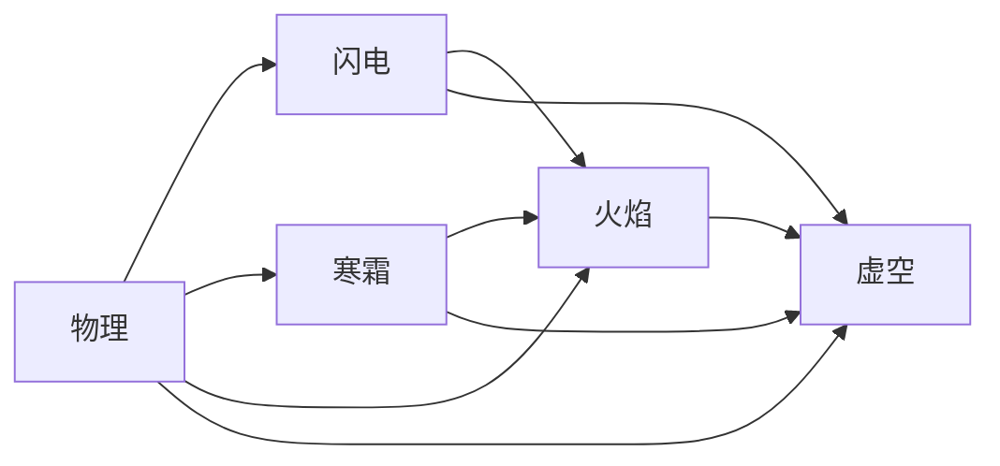

# P30 战斗公式与三类构筑来源统一平衡规格

> 状态：核心实施中（战斗公式、1475 节点主树、18 升华、珠宝与美德/恶德已接入；技能基础表、36 构筑与最终验收待完成）
> 更新日期：2026-09-01
> 前置阶段：P26～P29
> 后续阶段：P31 表现、性能与 v0.4 封版

## 1. 阶段定位

P30 一次完成战斗公式底层封版，以及主天赋、升华、装备词缀、技能和 36 套固定构筑的统一平衡。P30 不再通过分别修补旧技能、P17 技能和 P24 技能来平衡，而是让在线、托盘、离线、48 小时模拟和固定种子审计全部调用同一条权威结算链。

P30 不新增职业、玩法或大型美术内容。技能动画、装备表现、战斗反馈和 v0.4 发布性能门禁仍由 P31 完成。

## 2. 已确认的通用计算口径

- 百分比统一使用 BP，`10,000 = 100%`。
- 同类“提高/降低”先进入同一个加法池；每条“更多/更少”独立相乘。
- 中间计算使用 64 位整数，每个有明确语义的阶段结束时默认向下取整；明确规定保留小数余量或向上取整的规则（如药剂充能获取与消耗）按专门条款执行。
- 五种伤害合计后才执行“成功命中至少造成 1 点伤害”，不得让每个伤害分量分别保底 1 点。
- 全部最终属性保留来源和公式轨迹，以便在角色面板、装备比较和自动审计中追溯。
- 当前测试阶段不维持旧测试存档兼容；数据结构变化时升级格式并重建测试档。

## 3. 基础属性与资源

第一批确认采用以下资源公式：

```text
最大生命 =
(80 + 8 × 角色等级 + 体魄 + 固定生命)
× (1 + 最大生命提高)
× 各最大生命更多倍率

最大法力 =
(40 + 2 × 角色等级 + 2 × 精神 + 固定法力)
× (1 + 最大法力提高)
× 各最大法力更多倍率

最大护盾 =
(装备基础护盾 + 2 × 能量 + 固定护盾)
× (1 + 护盾提高)
× 各护盾更多倍率
```

每点基础属性的第一批确认收益：

| 属性 | 每点收益 |
| --- | --- |
| 体魄 | `+1` 最大生命；攻击伤害提高 `0.2%`；眩晕承受阈值提高 `0.2%` |
| 灵巧 | `+2` 命中；`+1` 闪避；攻击速度提高 `0.05%`；法术压制 `+0.02%` |
| 精神 | `+2` 最大法力；`+4` 灵障；异常和诅咒持续时间降低 `0.2%`；法力恢复提高 `0.1%` |
| 能量 | `+2` 最大护盾；护盾充能速度提高 `0.5%` |

基础法力恢复为每秒最大法力的 `6%`；默认没有生命再生。护盾在 2 秒未受伤后开始充能，基础充能速度为每秒最大护盾的 `20%`。异常持续时间降低上限为 `75%`。

### 3.1 已确认的灵障规则

灵障是持续生效的持续伤害防御数值，不是会被打空、需要恢复或充能的资源池。由于只覆盖持续伤害，灵障必须相对容易获取并自然成长。

```text
角色天然灵障 = 2 × 角色等级 + 4 × 精神

最终灵障 =
(角色天然灵障 + 装备最终基础灵障 + 全局附加灵障)
× (1 + 全局灵障提高)
× 各灵障更多倍率

灵障前持续伤害 DPS =
所有当前持续伤害经过抗性、物理抗性和其他承伤修正后的合计 DPS

灵障减伤率 =
min(80%, 最终灵障 / (最终灵障 + 1.5 × 灵障前持续伤害 DPS))

最终持续伤害 DPS =
灵障前持续伤害 DPS × (1 - 灵障减伤率)
```

- 所有同时存在的持续伤害先合计，再计算一次灵障，不能让大量小型持续伤害分别享受完整减免。
- 灵障覆盖流血、中毒、点燃、虚空腐化、普通技能持续伤害、伤害地面和自身技能造成的自我持续伤害。
- 灵障不覆盖击中、技能生命消耗、献祭生命、“失去生命”、固定资源扣除和永久死亡挑战明确标记的规则伤害。
- 普通怪物词缀不能完全无视灵障；如特殊挑战未来需要灵障穿透，必须在挑战说明中明确展示。
- 只靠等级和少量精神的普通角色也应获得有感减伤；多件精神底材的构筑目标为约 `50%～70%`，专精构筑可以达到 `80%` 上限。
- 精神系与精神混合底材提供基础灵障；词缀 T1 预算按装备一次性提案第 5.1 节执行，底材分配由同一数据表和 36 套构筑审计校准，不再逐装备类型确认。
- 灵障曲线的关键点为：灵障等于灵障前 DPS 时减伤 `40%`；2 倍时减伤约 `57.14%`；3 倍时约 `66.67%`；6 倍时达到 `80%` 上限。

## 4. 已确认的装备局部计算

武器与防具均使用用户确认的新顺序，品质与局部提高属于两个独立乘区：

```text
武器最终基础伤害 =
(底材基础伤害 + 局部附加伤害)
× (1 + 局部伤害提高)
× (1 + 品质)

防具最终基础防御 =
(底材基础防御 + 局部附加防御)
× (1 + 局部防御提高)
× (1 + 品质)
```

- 武器分别计算最小值和最大值。
- 护甲、闪避、护盾与灵障分别计算，不互相共用局部提高。
- 局部结果完成后才进入角色全局属性汇总。
- 品质通常为 `0%～20%`，苍誓等已确认来源可以达到 `40%`。
- 词缀数据中的 `Local` 必须进入上述局部管线，不能继续按全身全局属性相加。

## 5. 已确认的伤害转化图

伤害转化禁止逆流和循环。P30 第一版只允许以下有向边：



对应可构造的路线包括：物转电、物转火、物转冰、物转虚空、冰转火、电转火，以及火/冰/电转虚空。允许连续经过多个合法阶段，例如 `物理 → 闪电 → 火焰 → 虚空`。

转化来源限定为：主动/辅助技能石自带规则、升华、主天赋、珠宝和装备。统一规则如下：

- 每个来源类型被转出的总比例最多为 `100%`；超过时按各条转化比例同比归一。
- 转化伤害同时保留“当前类型”和“历史类型”。当前类型决定敌方防御、异常和显示；历史类型决定可用的进攻修正。
- 每一种经过的伤害类型拥有自己的转化阶段 `increase` 加法池，不同阶段池之间相乘。同一种伤害类型的多条 `increase` 仍先相加。
- 每条 `increase` 只归入它在该伤害分支上最早开始适用的阶段，并且只计算一次。通用伤害、攻击/法术、武器类型、近战/投射物/范围、持续伤害、召唤物等从初始伤害就适用的提高，与初始伤害类型提高进入同一个首阶段加法池，不再单独制造乘区；“元素伤害提高”等宽泛类型修正进入首次成为元素伤害的阶段，后续经过其他元素类型时不重复计算。
- 例如 `100` 点物理伤害经过 `100% 物理转火焰`，拥有 `200% 物理伤害提高` 和 `50% 火焰伤害提高` 时，类型乘区为 `100 × (1 + 200%) × (1 + 50%) = 450`，而不是 `100 × (1 + 250%) = 350`。
- 上例若再拥有 `40% 攻击伤害提高`，攻击提高在物理首阶段与物理提高相加，结果为 `100 × (1 + 200% + 40%) × (1 + 50%) = 510`，不得错误计算成 `100 × 3 × 1.5 × 1.4 = 630`。
- 多阶段转化会依次获得所有经过类型的独立乘区。例如 `物理 → 闪电 → 火焰 → 虚空` 可以依次乘物理、闪电、火焰和虚空四个类型提高池。由于该规则会显著放大长转化链，转化比例、类型提高数值和获取数量必须作为同一预算共同平衡。
- 类型 `more/less` 保留转化历史，每条独立相乘；同一个修正即使同时匹配历史中的多个类型也只计算一次，同一稳定 ID 也不能在一条分支上自行重复计算，除非规则明确允许叠层。
- 部分转化按每条分支独立保留历史并计算；不同历史的分支即使最终成为同一类型，也先分别结算进攻修正，之后才合并为当前类型伤害。
- 同一来源类型被转出的总比例超过 `100%` 时同比归一，不设置技能石、天赋、装备等隐藏优先级。拆分使用 BP 并按稳定边顺序分配整数余数，保证总基础伤害守恒且在线、离线和模拟一致。
- “额外获得某类型伤害”不消耗原伤害，按该阶段尚未计算 `increase/more` 的基础伤害创建新分支；新分支同时记录来源与目标类型，可以继续沿合法下游路径转化或产生下游额外伤害，但不能逆流或循环生成自身。
- 多个“额外获得”效果可以同时生效，不受转化 `100%` 上限约束；暂不设置统一硬上限，通过来源预算和 36 套构筑审计控制。
- 不开放闪电转冰、火焰转冰、火焰转闪电、虚空转元素或虚空转物理。

## 6. 已确认的攻击、法术与暴击基础

- 攻击以武器最终基础伤害为基础，再加入适用的全局附加伤害和技能伤害倍率。
- 徒手与盾击使用各自明确的攻击来源，不借用主手武器伤害；徒手条件、共享连击、额外打击目标、盾牌局部防御转点伤及灵障转攻速见 [`P30_PASSIVE_CLUSTERS.md`](P30_PASSIVE_CLUSTERS.md) 第 9～10 节。单手/双手/双持与武器类型的叠加及双持逐手结算见第 11.1 节。
- 普通法术使用技能石等级对应的独立基础最小/最大伤害，不读取武器物理伤害。
- 只有法武、符刃、攻击触发法术等明确规则可以引用武器伤害。
- 每个会直接造成伤害的主动技能必须在“攻击”和“法术”中严格二选一，不得同时具有两个标签。
- 光环、战吼、纯护卫等不直接造成伤害的技能可以两个标签都没有；反击、触发、陷阱、召唤等机制按实际伤害载荷分别归入攻击或法术。法武等混合构筑通过显式继承/转化规则联动两类属性，不通过给同一个伤害技能同时添加攻击和法术标签实现。
- 攻击的默认基础暴击率取决于当前武器；徒手使用徒手基础暴击率。
- 法术基础暴击率由对应主动技能石定义。
- 暴击率提高必须乘在基础暴击率上，不能继续作为固定基础暴击率直接相加。
- 默认暴击伤害为 `150%`，暴击率上限为 `100%`。

命中公式采用已确认的新曲线：

```text
有效闪避 = (目标闪避 / 4) ^ 0.8
基础命中率 = 攻击者命中 / (攻击者命中 + 有效闪避)
最终命中率 = clamp(基础命中率 / 0.98, 5%, 100%)
```

法术默认必中；“必中”规则直接得到 `100%`。攻击未命中仍支付资源并占用完整动作。面板显示两位小数，内部按 BP 判定。

攻击、施法与冷却采用已确认的独立时序：

```text
最终攻击频率 =
武器最终基础攻击频率 × (1 + 攻击速度提高) × 各攻击速度更多倍率 ÷ 技能攻击时间倍率

最终施法时间 =
基础施法时间 ÷ (1 + 施法速度提高) ÷ 各施法速度更多倍率

最终冷却 =
基础冷却 ÷ (1 + 冷却恢复提高) ÷ 各冷却恢复更多倍率
```

攻击/施法速度不缩短冷却，冷却恢复也不缩短动作时间。连续使用同一技能时，实际频率由动作完成时间和共享冷却完成时间中更晚的一项决定。

## 7. 已确认的防御公式与怪物防御成长

### 7.1 护甲、抗性与防御上限

物理击中使用以下护甲公式：

```text
护甲减伤率 =
min(90%, 有效护甲 / (有效护甲 + 5 × 护甲前物理击中伤害))
```

护甲减伤先于物理抗性结算，护甲公式的分母必须使用尚未经过物理抗性和目标承伤修正的原始物理击中分量，避免物理抗性反过来增强护甲效率。转化后的伤害只使用当前最终类型对应的防御；已经转为火焰的物理来源伤害不再套原物理防御。第三组元素装甲为明确例外：使用护甲的 30% 单独抵御各最终元素击中分量，仍先护甲后抗性，不作用于虚空或元素持续伤害。

```text
未封顶抗性 = 基础抗性 + 族群/词缀/地图修正 - 抗性降低
面板抗性 = clamp(未封顶抗性, -500%, 抗性上限)
击中实际抗性 = clamp(面板抗性 - 对应穿透, -500%, 抗性上限)
```

- 怪物物理抗性常规上限 `35%`、绝对上限 `50%`。
- 元素和虚空抗性默认上限 `75%`、绝对上限 `90%`。
- 玩家和怪物的所有抗性最低值统一为 `-500%`，为深度降抗、穿透和转化构筑保留空间。
- 抗性降低影响击中和持续伤害；穿透只影响对应击中。
- 破甲只降低护甲；物理穿透只降低本次击中使用的物理抗性，两者不得混用。

### 7.2 T1～T20 怪物基础抗性

T1 与 T20 之间按地图层级线性插值并取整。虚空抗性比同档元素抗性高 `5%`，用于抵消侵蚀和凋零的强力收益。

| 怪物稀有度 | T1 物抗 | T1 元素抗 | T1 虚空抗 | T20 物抗 | T20 元素抗 | T20 虚空抗 |
| --- | ---: | ---: | ---: | ---: | ---: | ---: |
| 普通 | 0% | 15% | 20% | 4% | 25% | 30% |
| 魔法 | 2% | 20% | 25% | 6% | 30% | 35% |
| 稀有 | 4% | 25% | 30% | 8% | 35% | 40% |
| 地图 Boss | 6% | 30% | 35% | 10% | 40% | 45% |
| 攻坚 Boss | 8% | 35% | 40% | 12% | 45% | 50% |

剧情怪物从接近 `0%` 抗性开始随等级成长，最终章接近 T1 数值。基础表之后再叠加公开展示的族群与玩法修正：物理抗性族群修正范围 `-3%～+6%`，单项元素/虚空抗性修正范围 `-10%～+15%`；魔法/稀有词缀、地图词缀和固定 Boss 可以继续添加明确展示的修正，但不能根据玩家输出暗中增加抗性。

### 7.3 怪物护甲成长

```text
T 层参考单次物理击中 = round(1000 × 1.09^(T - 1))

怪物护甲 =
5 × 参考击中 × 目标减伤率 / (1 - 目标减伤率)
```

参考击中约为：T1 `1,000`、T5 `1,412`、T10 `2,172`、T15 `3,342`、T20 `5,142`。

| 怪物稀有度 | T1 面对参考击中的目标护甲减伤 | T20 面对参考击中的目标护甲减伤 |
| --- | ---: | ---: |
| 普通 | 15% | 20% |
| 魔法 | 20% | 25% |
| 稀有 | 25% | 30% |
| 地图 Boss | 25% | 30% |
| 攻坚 Boss | 30% | 35% |

中间层级线性插值目标减伤后反推护甲。护甲族群和铁甲词缀乘算护甲数值，不额外增加物理抗性；因此小而快的物理击中受到明显限制，超大单次物理伤害仍能有效突破护甲。

### 7.4 物理持续伤害的 30% 护甲

物理持续伤害可以使用 `30%` 的有效护甲，避免没有灵障时被物理持续伤害过快击杀。持续伤害不按模拟 tick 分割后逐次套护甲，而是先合计当前物理持续伤害 DPS：

```text
物理持续伤害用护甲 = 有效护甲 × 30%

物理持续伤害护甲减伤率 =
min(90%, 物理持续伤害用护甲 /
    (物理持续伤害用护甲 + 5 × 当前合计护甲前物理持续伤害 DPS))
```

物理持续伤害随后继续计算物理抗性、目标持续伤害承受修正和灵障。破甲会先改变有效护甲，所以也会削弱这层物理持续伤害防护。

### 7.5 击中与持续伤害结算顺序

击中顺序固定为：命中/闪避 → 转化与进攻修正 → 暴击 → 按当前类型汇总 → 格挡 → 对应分量护甲（通常仅物理，元素装甲为明确例外）→ 各类型抗性 → 目标承伤提高/更多/更少 → 法术压制 → 守护类固定吸收 → 明确的法力分担 → 明确的迟伤缓冲 → 护盾 → 生命。完整格挡零伤害不产生伤害型异常；部分格挡剩余伤害仍可被压制并正常计算异常。迟伤只改变扣除时间，异常等击中结果按防御后、迟伤拆分前的伤害计量一次；偷取仍排除过量击杀。分期不重复产生击中、异常、偷取、受击触发或第二次防御，详见第三组第 20.2 节。

持续伤害顺序固定为：生成并按类型合计 → 物理持续伤害使用 30% 护甲 → 各类型抗性 → 目标持续伤害承受提高/更多/更少 → 合计灵障前持续伤害 DPS → 灵障 → 护盾/生命。持续伤害不能闪避、格挡或压制。

### 7.6 P30 格挡、压制与护体上限

- 攻击/法术格挡分开计算，默认概率上限各 75%、绝对上限各 90%；不默认要求盾牌，仅写明持盾的效果要求盾牌。完整格挡免除全部伤害，部分格挡规则取要求承受比例最高者，不连续乘算。
- 法术压制概率上限 100%，成功时基础减伤 70%，减伤效果绝对上限 90%；完整格挡不再触发压制，部分格挡剩余法术伤害可以压制。
- 护体每层提供 1% 击中伤害总降，基础上限 20 层、绝对上限 30 层；同一池合计而非逐层独立相乘，不防持续伤害。
- 守护是固定容量吸收而非能量护盾，同时只保留一个吸收池；新守护容量不小于旧守护剩余容量时以新容量及持续时间替换，否则保留旧守护且不刷新时间。未替换仍支付消耗并进入冷却。
- 迟伤缓冲是已结算伤害的延期，不当作持续伤害再享受灵障或重复减伤。完整节点与边界见第三组第 11～15、20 节。

## 8. 已确认的穿透、降抗、侵蚀、凋零与破甲

### 8.1 降抗、穿透与无视抗性

- 降低抗性在抗性封顶前计算，影响击中与持续伤害；堆叠溢出抗性可以抵抗降抗。
- 穿透在抗性封顶后计算，只影响来源自己的对应类型击中；溢出抗性不能抵抗穿透。
- 同类型穿透全部相加，不设独立硬上限，只受最终 `-500%` 抗性下限约束。
- “无视抗性”将该次伤害面对的对应抗性固定视为 `0%`，正抗性和负抗性都不保留。因此它面对高正抗目标有利，面对负抗目标反而会损失降抗收益，属于需要权衡的规则。
- 同名降抗只取最高值；不同名称、不同稳定 ID 的曝露、诅咒、侵蚀、技能独立降抗和升华/传奇规则可以叠加。
- 同一技能重复施加非层数型降抗只刷新持续时间。Boss 不具备隐藏降抗免疫；若有降低诅咒效果，必须公开展示。

### 8.2 元素曝露

曝露只用于火焰、寒霜和闪电；虚空使用侵蚀，物理使用破甲。

```text
基础元素曝露：对应元素抗性 -15%
基础持续时间：6 秒
单项曝露降抗上限：-50%
```

同一元素只能存在一份曝露并取最强效果；不同元素曝露可以共存。天赋、升华和技能可以提高曝露效果；“元素曝露”可以同时施加三种曝露，但每种分别遵守 `-50%` 上限。

### 8.3 侵蚀与凋零

```text
侵蚀：每层降低 10% 虚空抗性；默认最多 5 层；绝对上限 10 层；基础持续 6 秒。
凋零：每层使目标承受 8% 更多虚空伤害；默认最多 10 层；绝对上限 15 层；基础持续 4 秒。
```

- 只有明确写有对应机制的技能或效果才能施加，不是所有虚空伤害默认附带。
- 每次施加默认增加 1 层，明确规则可以一次增加多层；新增层数会刷新该减益全部层数的持续时间。
- 侵蚀每层固定降低 `10%`，不提供“侵蚀效果提高”，只允许提高层数上限、单次施加层数和持续时间。
- 凋零不是降抗，每层独立相乘：10 层约为 `1.08^10 = 2.159` 倍虚空承伤，15 层约为 `1.08^15 = 3.172` 倍。
- 侵蚀、虚空抗性诅咒和凋零可以完整共存，获取位置必须按高预算设计。

### 8.4 破甲、忽略护甲与物理穿透

```text
破甲：每层使目标护甲降低 10%；默认最多 5 层；专精可提高至 8 层；绝对上限 9 层；基础持续 5 秒。
破甲及其他护甲降低合计上限：90%。
忽略护甲合计上限：90%。
```

- 破甲修改目标有效护甲，后续所有物理击中和物理持续伤害的 30% 护甲都受益；破甲不降低物理抗性。
- 忽略护甲只影响来源自己的物理击中；物理穿透只降低来源自己的物理击中所面对的物理抗性。
- `破甲后护甲 = 基础有效护甲 × (1 - 破甲及其他护甲降低)`。
- `本次击中使用护甲 = 破甲后护甲 × (1 - 本次忽略护甲比例)`。
- 破甲和忽略护甲可以继续乘算，使专精物理构筑接近完全突破护甲。

### 8.5 减益应用时点

曝露、侵蚀、凋零和破甲默认在造成伤害后施加，触发它们的本次击中不能享受刚施加的效果；后续击中以及本次击中生成的持续伤害从第一次跳伤开始受益。只有明确写有“伤害结算前施加”的规则才能让当前击中立即受益。Boss 阶段切换可以清除减益，但必须在玩法说明和战斗报告中明确显示。

第二组已确认的补充规则：同一击中多个节点提供基础施加层数时取最高，明确写“额外”的才叠加，随后检查总层数上限；不因主角、佣兵、召唤物分别施加而复制多套上限。完整节点及单相解构等明确例外见 [`P30_DAMAGE_AILMENT_CLUSTERS.md`](P30_DAMAGE_AILMENT_CLUSTERS.md) 第 19～25 节。

## 9. 已确认的异常状态完整公式

### 9.1 异常伤害基础与通用规则

```text
异常基础伤害 =
对应当前伤害类型在目标防御前的基础伤害
× 所有适用于该异常的 increase
× 所有适用于该异常的 more/less
```

- 当前类型决定能否产生异常，历史类型只决定哪些类型修正可以适用。物理转火可以点燃但不能流血，物理转虚空可以中毒但不能流血。
- 物理伤害提高可以强化流血及保留物理历史的中毒；攻击、法术、近战和投射物伤害提高默认只强化击中，除非明确写有“造成的异常伤害”。
- 通用伤害、持续伤害、对应类型伤害和异常专属伤害可以强化异常。
- 异常生成时快照攻击者属性；目标抗性、承伤、灵障等防御在每次结算时动态读取。
- 暴击产生的伤害型异常默认获得 `+50%` 持续伤害倍率；持续伤害自身不能暴击。
- 异常概率先由攻击者判定，再判定目标异常避免；概率上限 `100%`，溢出概率默认不转化为异常效果。
- 同一次击中可以施加多个满足条件的异常；“无法造成某异常”优先于概率及暴击保证。伤害为 `0` 的击中不能施加伤害型或伤害量相关异常。
- 新异常在本次击中结算后生效，不能反向强化产生它的击中。怪物的免疫、避免、效果降低和持续时间降低必须公开显示。

### 9.2 流血、中毒与点燃

```text
流血 DPS = 流血异常基础物理伤害 × 70%；基础持续 5 秒。
中毒 DPS = (物理异常基础伤害 + 虚空异常基础伤害) × 30%；基础持续 2 秒。
点燃 DPS = 点燃异常基础火焰伤害 × 90%；基础持续 4 秒。
```

- 流血只由当前物理击中产生，默认需要流血概率且暴击不自动流血；默认只有 DPS 最高的一层造成伤害，其他未到期实例保留以便最强实例结束后接替。不根据目标移动提供额外倍率。规则型“血舞”专精可以让最多 8 层同时生效，但每层只有普通流血的 `50%`。
- 中毒由当前物理或虚空击中产生，默认需要中毒概率且暴击不自动中毒；层数没有玩法硬上限，每层独立结算。实现可将相同来源、相同 DPS 和相近剩余时间的实例合并为计数桶，但不得改变总伤害。中毒最终为虚空持续伤害。
- 点燃由当前火焰击中产生；非暴击需要点燃概率，火焰暴击默认具有 `100%` 点燃概率。默认只有 DPS 最高的一层生效，其他燃烧地面和火焰持续伤害仍可共存。规则型专精可以让两层点燃同时生效，但每层只有普通点燃的 `70%`。

持续伤害通用、流血、中毒、点燃的完整节点及配套规则已确认，见 [`P30_DAMAGE_AILMENT_CLUSTERS.md`](P30_DAMAGE_AILMENT_CLUSTERS.md) 第 14～18 节：

- 持续伤害倍率按百分点相加；异常加快保留总伤害；持续时间提高不降低 DPS。
- 孤创成痕、斧类血瀑、血舞为互斥流血模式；孤焰焚尽与烈焰双生互斥。未生效的候选实例不计入多层条件和提前结算预算。
- 传播复制进攻快照与剩余时间，并在新目标处重新处理防御；传播副本不继续传播。
- 提前结算只消费生效实例的剩余伤害，按移除前当前防御与合计 DPS 计算，不把剩余总伤害输入灵障、不重复防御；属于持续伤害而非击中。同异常的同事件消费只结算最高比例一次。

### 9.3 异常阈值

```text
基础异常阈值 = 最大生命 + 最大护盾
实际异常阈值 = 基础异常阈值 × 稀有度系数 × (1 + 异常阈值提高)
```

| 目标 | 稀有度系数 |
| --- | ---: |
| 玩家/普通怪物 | 100% |
| 魔法怪物 | 90% |
| 稀有怪物 | 80% |
| 地图 Boss | 25% |
| 攻坚 Boss | 15% |

Boss 生命很高，因此较低系数仍会产生显著高于普通怪物的绝对阈值。怪物详情必须显示实际异常阈值，不能使用隐藏 Boss 异常免疫。

### 9.4 冰缓与冻结

```text
冰缓效果 = 30% × (最终寒霜击中伤害 / 异常阈值)^0.4
冻结持续时间 = 3 秒 × (最终寒霜击中伤害 / 异常阈值)^0.4
                 × (1 + 冻结持续时间提高)
```

- 所有寒霜击中都可以冰缓；冰缓低于 `5%` 时不施加，默认上限 `30%`、规则型硬上限 `50%`，基础持续 `2` 秒。冰缓同时降低移动、攻击和施法速度，多份只取效果最高者。
- 非暴击需要冻结概率；寒霜暴击默认具有 `100%` 冻结概率，但仍须达到 `0.3` 秒最低持续时间。
- 单次冻结上限：普通/魔法 `3` 秒、稀有 `2` 秒、地图 Boss `1` 秒、攻坚 Boss `0.5` 秒。冻结停止移动、攻击和施法，但持续伤害、已有投射物和冷却继续运行。
- 明确标记的 Boss 不可打断技能可以完成当前动作，但冻结时间在动作结束后开始，不能被动作吞掉。

### 9.5 感电与麻痹

```text
感电效果 = 50% × (最终闪电击中伤害 / 异常阈值)^0.4

麻痹积累 = 40 × (最终闪电击中伤害 / 异常阈值)^0.4
             × (1 + 麻痹积累提高)
```

- 非暴击需要感电概率；闪电暴击默认具有 `100%` 感电概率。感电低于 `5%` 时不施加，默认上限 `50%`、规则型硬上限 `100%`，基础持续 `2` 秒。
- 感电属于影响所有伤害类型的“承受伤害提高”，与其他承伤提高相加；多份感电只取最高效果。
- 只有通过麻痹概率判定的闪电击中才积累麻痹；暴击不自动获得麻痹概率。积累到 `100` 时触发并清空；2 秒未获得积累后每秒衰减 25 点。
- 麻痹基础持续 `1` 秒；普通、魔法、稀有、地图 Boss、攻坚 Boss 的单次上限分别为 `1/0.8/0.6/0.35/0.2` 秒。麻痹中断可打断动作并阻止移动、攻击和施法；不可打断 Boss 动作结束后才开始计算麻痹时间。
- 感电和麻痹可以由同一次击中产生。

### 9.6 眩晕

```text
眩晕阈值 = 异常阈值 × (1 + 体魄 × 0.2% + 其他眩晕阈值提高)

眩晕概率 =
clamp(200% × 最终实际击中伤害 / 眩晕阈值, 0%, 100%)
```

- 所有击中都可眩晕；基础持续 `0.35` 秒。普通/魔法、稀有、地图 Boss、攻坚 Boss 的单次上限分别为 `1.5/1/0.5/0.25` 秒。
- 眩晕中断当前可打断动作。完整格挡伤害为 `0`，因此不会眩晕；部分格挡及法术压制后的实际剩余伤害用于计算眩晕。
- 武器、技能和天赋可以提供眩晕概率、眩晕阈值降低与持续时间提高。

第二组已确认的控制补充规则：

- 攻击者的眩晕阈值降低在目标自身阈值计算完成后生效，同类相加、合计最多降低 75%，只影响该来源的眩晕判定；眩晕概率修正全部完成后再封顶 100%。
- 同种控制连续施加取较晚结束时间，不累加时长；不同控制同时计时，不排队轮流生效。
- Boss 不可打断动作结束后才开始控制，每种最多保留一份最长的待生效控制；不无限排队。本轮不新增控制递减或隐藏免疫，后续审计连续控制覆盖率。
- 冰封起点的冻结时长保底、微电成灾的感电效果保底属于已确认的明确例外，不取消一般异常资格与避免判定。详见第二组正式节点表。

在线、离线和 48 小时模拟必须使用相同的异常实例、快照、积累与随机序列。

## 10. 已确认的恢复体系

### 10.1 普通偷取

```text
偷取总量 = 本次最终实际击中伤害 × 对应偷取比例
单个偷取实例基础持续时间 = 2 秒
单个实例基础恢复速度 = 偷取总量 / 2 秒
```

- 不设置单个实例恢复速度上限。多个实例速度相加后，生命、法力和护盾偷取分别受每秒对应最大资源 `35%` 的总恢复上限限制；被上限截断的部分不会丢失，而是延长实例完成时间。
- 未命中、完整格挡、实际伤害为 `0`、持续伤害和超过目标剩余资源的过量击杀伤害不能产生偷取；部分格挡按实际剩余伤害处理，不因格挡标志直接排除。
- 召唤物、伙伴和构装体默认为自己偷取，只有明确规则才能转给主人。
- 偷取属性只保留“伤害的 X% 偷取”“偷取恢复速度提高”“最大偷取总恢复上限提高”和瞬偷类规则。删除“偷取总恢复量提高”与“偷取持续时间提高/降低”，不得生成对应词缀。

### 10.2 瞬间偷取与过量偷取

```text
瞬间恢复量 = 本次生成的偷取总量 × 瞬偷比例
```

- 仅扣除实际瞬间恢复量，剩余预算生成普通偷取实例；因瞬偷上限受限的预算回到普通偷取，而非丢失，随后仍遵守满资源结束/过量偷取规则。普通瞬偷每次击中最多立即恢复对应最大资源的 `10%`，一秒内所有瞬偷合计最多恢复 `35%`；瞬偷不占普通偷取的每秒上限。
- 普通天赋/珠宝提供部分瞬偷，核心升华或传奇可以达到 `100%`；“全部瞬偷”仍遵守单次与每秒限制，除非规则明确修改。
- 瞬偷发生在伤害后，不能阻止本次致死伤害。
- 默认资源回满时对应偷取实例结束，满资源时不能继续积累。获得“过量偷取保留”后，满资源仍可产生和保留实例，最多储存对应最大资源 `200%` 的待恢复量；停止造成可偷取伤害 5 秒、切图、回城、死亡或换队时清空。
- 过量偷取不能让资源超过最大值，也不会自动转换成护盾；仍有有效普通实例时可以维持“偷取中”增益，单独一次瞬偷不构成持续偷取状态。明确的虹吸转灵先分配生命/护盾预算，再应用各自速度与上限，不复制预算。

### 10.3 再生、持续恢复与护盾充能

```text
每秒持续恢复 =
(固定每秒恢复 + 最大资源 × 百分比再生)
× (1 + 对应恢复提高)
× 各恢复更多/更少倍率
```

- 基础生命再生 `0%`、基础法力恢复每秒最大法力 `6%`、基础护盾再生 `0%`。再生不设统一硬上限；恢复降低最多将恢复压到 `0`，不能反转成伤害。
- 自我持续伤害和恢复分别结算并分别记录。“恢复量提高”改变总量，“恢复速度提高”缩短完成相同总量的时间；通用恢复率提高影响再生、偷取、药剂、击回和护盾充能，除非词条限制类型。
- 护盾在实际承受伤害后 2 秒开始充能，基础每秒恢复最大护盾 `20%`。击中或持续伤害实际扣除护盾/生命会重置延迟；格挡、闪避、零伤害、资源消耗、献祭和失去生命不会重置。
- 护盾充能可以与护盾偷取、护盾再生和击回并存；“充能不被持续伤害打断”只能由明确规则提供。

### 10.4 击中回复与击杀恢复

- 击中回复在每次对一个目标造成实际击中伤害后立即恢复固定资源；范围、多目标、穿透、连锁、分裂和返回的每个实际命中目标可分别触发，但同一伤害事件不能对同一目标重复触发。
- 未命中、完整格挡、零伤害和持续伤害不触发，部分格挡按实际剩余伤害处理。每种资源的击中回复合计上限为每秒最大资源 `50%`，并在角色面板显示；召唤物默认回复自身。
- “击杀回复”不进入通用装备词缀或普通天赋属性库。升华、技能和传奇仍可提供写明数值与条件的规则型击杀恢复，以保留血征者等已确定机制。
- 每个死亡目标对同一收益拥有者只触发一次；直接、持续伤害和可归属召唤物击杀均可计入，无经验/掉落/药剂充能的召唤单位不能提供。规则型击杀恢复立即执行、不设每秒硬上限且不能溢出最大资源。

### 10.5 药剂与自动使用

- 初始 3 个、最终最多 5 个药剂槽；新角色拥有生命与法力药剂。每张地图开始时所有已装备药剂补满。
- 击杀普通/魔法/稀有/Boss 分别为每瓶已装备药剂提供 `1/2/4/6` 点充能；完成地图节点为每瓶提供 10 点。无奖励召唤物不提供；主角、持续伤害与主角召唤物击杀均正确归属。
- 初始生命药剂最大 30 充能、消耗 10，3 秒恢复 `50%` 最大生命；初始法力药剂最大 30、消耗 10，3 秒恢复 `30%` 最大法力。高级底材和词缀按装备一次性提案统一审核，不再逐装备类型拆轮。
- 默认生命低于 `60%`、法力低于 `35%` 时自动使用；当前有效药剂恢复足以回到触发线以上时不重复使用。
- 同一药剂再次使用会替换旧实例并丢失未完成恢复；普通生命/法力药剂在资源回满时提前结束。保持满资源后持续等例外由明确词缀提供。
- 多瓶同类药剂按玩家优先级、剩余充能比例、装备槽顺序决定。高级 AI 可读取敌人危险度、资源比例、药剂效果与充能，但不能读取未鉴定掉落。

药剂天赋、小点增强及完整边界见 [第三组第 19 节](P30_DEFENSE_RESOURCE_CLUSTERS.md#19-药剂天赋簇已确认含小点增强)。恢复量、恢复速度与功能药剂效果/持续时间分开；充能获取及返还保留小数余量，最终充能消耗在全部修正后向上取整且最低 1 点。同瓶重用仍替换旧实例；返还不触发新一次使用，不放大布尔免疫或突破防御绝对上限。

### 10.6 恢复顺序与报告

同一战斗时点按“承受伤害/支付资源 → 瞬偷 → 击回/规则型击杀恢复 → 药剂 → 再生 → 普通偷取 → 护盾充能”结算。角色已经死亡后，后续恢复不能将其救活；恢复不能递归触发恢复或伤害，反射伤害不能为来源生成偷取，超过最大资源的恢复默认丢失。

战斗报告分别统计再生、普通偷取、瞬偷、击回、规则型击杀恢复、药剂和护盾充能；在线、离线和 48 小时模拟使用同一恢复实例、上限和药剂 AI。

## 11. 已确认的投射物、范围与重复击中规则

### 11.1 真实飞行、多重投射与防散弹

- `1` 战斗距离单位等于 `1000` 内部坐标；投射物飞行时间等于实际距离除以投射物速度。投射物必须实际移动并使用连续轨迹碰撞，碰撞体与立绘裁切/动画无关。
- 投射物速度只改变到达时间，投射物距离属性才改变最大距离。攻击投射物空间碰撞后仍判定命中；法术投射物默认必中。普通 AI 只按可见速度有限预判，只有“追踪”投射物能持续修正方向。
- 同一次技能使用的多个普通投射物可命中不同敌人，但去程默认不能重复命中同一目标；子投射物继承技能使用 ID。只有明确的齐射集中/弹幕规则可以散弹，并必须设置倍率或同目标间隔。
- 额外投射物本身无统一伤害惩罚；当前多重投射辅助仍为“额外 2 个、单发伤害 20% 更少”。

### 11.2 穿透、分裂、连锁与返回

- 穿透数量 `N` 表示首次命中后还能穿过 `N` 个敌人，最多命中 `N+1` 个；同一去程不能重击旧目标。当前贯穿辅助为额外穿透 2 个，每完成一次穿透后续伤害 `8%` 更少，两次后为 `0.92² = 84.64%`。
- 投射物首次满足分裂条件时原弹结束并默认生成 2 个子弹；子弹朝其他目标或对称方向发射，不能再次分裂、不能命中分裂目标，并继承剩余穿透/连锁/返回。当前裂射辅助的子弹伤害 `30%` 更少。
- 穿透耗尽后才连锁。每次连锁选择范围内最近且本序列未命中的目标，距离相同时按稳定 ID；无目标即结束。连锁有实际传播时间。当前连锁辅助额外连锁 2 次、无基础伤害惩罚。
- 返回在最大距离或前序机制完成后开始，飞向施法者当前位置；去程和回程对同一目标各最多命中一次。回程不再分裂或连锁，抵达施法者/施法者死亡/离场后消失。当前返回辅助的回程伤害 `25%` 更少。
- 统一优先级为“首次分裂 → 子弹穿透 → 穿透耗尽后连锁 → 连锁结束后返回”。每个投射物保存技能使用/家族 ID、阶段、已命中集合、剩余次数和独立倍率。

### 11.3 技能距离与范围面积

```text
最终技能距离 = 基础距离 × (1 + 距离提高) × 各距离更多倍率
最终范围面积倍率 = (1 + 范围效果提高) × 各范围效果更多倍率
最终半径 = 基础半径 × sqrt(最终范围面积倍率)
```

- 面积提高 `100%` 对应半径约 `1.414` 倍。圆/环/地面按半径计算；锥形等比扩大长度和宽度并保持基础夹角。
- 技能距离决定接敌和可施放位置；近战打击距离不扩大范围爆炸。范围面积倍率最低 `25%`，范围变化不改变单位碰撞体。

### 11.4 重叠、命中间隔与重复

- 同一瞬时范围事件对每个目标只命中一次；同一次技能使用的多个普通爆炸重叠时默认也只承受一次。允许重叠的技能必须明确设置单目标倍率或间隔。
- 持续区域按 DPS 连续结算，不能触发击回；周期性击中区域记录每目标间隔，默认不得低于 `0.25` 秒且不随帧率改变。
- 一组重复属于一次激活，只支付一次资源、充能和共享冷却；每次重复拥有新技能使用 ID，可再次命中同一目标，并占用动作直至整组完成。
- 微走位不打断重复，眩晕/冻结/麻痹可以取消未执行重复。法术默认锁定原位置；近战可在原目标死亡后重选近目标；投射物重新瞄准当前目标。
- 触发技能默认不能再重复或触发以防循环；共享冷却从首次激活开始，但整组完成前不能再次使用。

穿透、分裂、连锁、返回和重复的每次合法命中分别计算命中、暴击、格挡、压制、异常、偷取和击回；防散弹阻止的事件不触发收益。在线、离线与战斗报告统一记录发射、命中、空间躲避及各机制贡献。

## 12. 已确认的召唤单位、伙伴、构装体、陷阱与幻身规则

### 12.1 类别、数量与替换

| 类别 | 基础上限 | 硬上限 | 超限处理 |
| --- | ---: | ---: | --- |
| 普通召唤物 | 6 | 16 | 移除最早召唤者 |
| 核心伙伴/灵兽 | 1 | 1 | 新伙伴替换旧伙伴 |
| 构装体 | 3 | 8 | 移除最早部署者 |
| 陷阱 | 3 | 8 | 移除最早布置者 |
| 幻身 | 由技能决定 | 6 | 移除剩余时间最短者 |

各类别互不占用数量；上限增加相加后受硬上限限制，上限降低时立即清到合法数量。被替换者视为消失，不触发死亡、自爆或击杀效果；不能因性能压力暗中降低上限。佣兵不属于本规则，仍按完整角色构筑处理。

### 12.2 普通召唤物与明确继承

```text
召唤物最终属性 =
技能等级基础属性
× (1 + 召唤物对应属性提高 + 明确继承的主角属性)
× 各召唤物更多倍率
```

- 默认不读取主角武器、普通攻击/法术/类型增伤、暴击、速度、偷取或击回，只享受召唤物属性与正确标签的连接辅助。每个伤害技能仍严格二选一标记攻击或法术。
- 基础攻击/法术、伤害、防御、命中和暴击由技能表定义；默认元素抗性 `40%`、虚空抗性 `20%`、物理抗性 `0%`。主角光环在实际范围内正常影响。
- “灵魂拓印”继承主角 `20%` 的通用伤害提高及攻击/施法速度提高；“完全继承”提高为 `50%` 并继承主角 `100%` 当前面板抗性。通用提高不含武器限定、技能限定、类型转化乘区或 `more`。

### 12.3 核心伙伴与抗性继承

- 核心伙伴固定唯一、没有独立装备栏，基础属性与 AI 由伙伴等级和形态决定；默认不继承主角普通伤害、生命或抗性，也不享受普通召唤物属性。
- 猛攻/守护/追猎形态改变技能、AI、距离和预算，不创建新单位；由预设或 AI 条件切换，不允许直接操作。
- 被击败后倒地 8 秒，以 `50%` 生命复起；回城或新地图开始时满生命。
- “共生灵核”继承主角 `50%` 通用伤害提高、`100%` 当前面板抗性，并把主角最大生命 `30%` 加入伙伴基础生命后再计算伙伴生命提高。
- 抗性继承读取主角当前已封顶面板值（含负抗和公开减益），随主角动态变化；不读取溢出抗性，结果仍受伙伴自身上限与 `-500%` 下限限制。同名比例只取最高。

### 12.4 构装体与陷阱

- 构装体是独立可受击单位，只享受构装体属性，默认不继承主角武器和普通伤害。静态炮台不移动；移动型必须有标签；远程构装默认保持 6～10 单位距离。普通炮台优先最近目标，升华炮台可优先精英/Boss。死亡后默认需重部署，明确规则可自动重铸；符文阵/光环按各自叠加上限。
- 陷阱是玩家技能的延迟释放方式、不可被攻击且没有生命。攻击陷阱在布置时快照主角武器与完整适用进攻属性，法术陷阱快照技能石属性；目标防御在触发时动态读取。
- 陷阱基础存在 8 秒、触发半径 2 单位、武装 0.5 秒；布置速度独立于攻施法速度。布置时支付资源/充能并启动冷却，触发时不再支付。
- 多个陷阱是不同技能使用，可以命中同一目标。陷阱不能为主角偷取或击回，除非明确允许；异常、击杀、掉落和药剂充能归主角。默认不能递归触发同类陷阱；超限移除不爆炸。

### 12.5 幻身与归属

```text
幻身伤害 =
主角对应技能已完成进攻计算的防御前伤害包 × 幻身复制比例
```

- 幻身不再次应用主角属性，保留原技能攻击/法术、类型历史、投射物、范围和异常资格，并使用独立技能使用 ID；不能支付资源、喝药、生成幻身或递归复制。
- 基础升华幻身持续 4 秒、上限 2、复制最近攻击并造成 `30%` 伤害；核心提高到上限 4、复制比例 `50%`；全局硬上限 6。到期或承担替身伤害属于消失，不触发召唤死亡收益。
- 所有单位保存直接所有者、类别、来源技能、创建序号和来源链。经验、掉落、地图完成及药剂充能归主角，战报分开统计。
- “你击杀”只含主角和陷阱；“你的单位击杀”包含召唤物、伙伴、构装和幻身。召唤物击杀可给全局药剂充能，但不触发仅写“你击杀”的规则。独立单位的偷取/击回默认回复自身；反射返回真正伤害来源。

### 12.6 AI、节点与持久化

- 可预设集火主角目标、仅 Boss、精英与 Boss、分散清怪、保护主角、保持远程距离等行为；换目标最短间隔 `0.25` 秒。AI 可读位置、稀有度、公开状态、地图危险与主角目标，不可读未鉴定掉落。
- 普通召唤物距主角超过 12 单位回归、超过 18 单位持续 1 秒传送；伙伴使用 10/16 单位。构装和陷阱固定；友方互不产生移动阻挡，微走位不打断攻击。
- 持续型普通召唤物可在同次远征节点间保留生命/持续时间/状态；临时召唤、陷阱、构装和幻身在节点结束清除。回城、结束远征、换配置或角色死亡清理普通召唤与部署物，伙伴回城恢复。
- 离线模拟保存或确定性重建单位数量、生命、持续时间、冷却及 AI 状态，不能因模式切换免费复活。

## 13. 已确认的怪物等级、族群与成长

怪物等级、基础生命/伤害、职责、稀有度、最高 6 倍族群差异、技能预算、节点组成和 Boss 目标已在 [`P30_MONSTER_BALANCE.md`](P30_MONSTER_BALANCE.md) 固化。本文件中的护甲、抗性、异常和伤害结算规则是该表的唯一底层公式。

## 14. 已确认的天赋簇结构

同一个专精类型可以拥有多个分散的天赋簇。以每种武器类型为例，目标结构为 3 个簇：

1. 两个中型簇：各 `3～4` 个小点、1 个显著节点、1 个专精节点。
2. 一个大型簇：`6～8` 个小点、2 个显著节点、1 个专精节点。

天赋簇可以使用环状、双入口或分叉连接，不要求点满所有小点才能进入显著节点。专精节点必须先分配该簇对应的显著节点才能选择。

- 同一专精类型可以在多个簇中出现，但同一个专精选项的全局互斥规则保持不变。
- 小点、显著和专精均可提供与该天赋簇主题有关的复合属性。
- 允许带代价的复合属性，例如“锤伤害提高但攻击速度降低”。
- 专精节点以规则变化为主，整体强度需要显著提高，不能继续只是低数值通用加成。
- 参考 PoE 的簇形和可选路径，但节点坐标、连接结构、底图和运行时拓扑必须使用本项目稳定 ID 精确一致。

用户已要求后续按天赋簇类型逐项确认。第一轮从武器专精开始，然后依次处理伤害类型、防御、资源、召唤/伙伴/构装、技能机制和通用规则簇。

第一组正式表见 [`P30_PASSIVE_CLUSTERS.md`](P30_PASSIVE_CLUSTERS.md)，共 12 类、36 簇，沉稳持械/战意回流的来源修订已确认；第二组 [`P30_DAMAGE_AILMENT_CLUSTERS.md`](P30_DAMAGE_AILMENT_CLUSTERS.md) 共 19 类、45 簇，浴火回生/雷息护体的来源修订也已确认。第三组 [`P30_DEFENSE_RESOURCE_CLUSTERS.md`](P30_DEFENSE_RESOURCE_CLUSTERS.md) 共 14 类、44 簇，完整节点及规则已确认；双重壁垒小点两种格挡各 +3 个百分点，三相抗御显著替换为最大三元素抗性各 +3 个百分点，药剂三簇小点已增强。前三组小计 45 类、125 簇、890 个主题节点，不含路径、珠宝孔和后续分组，尚未实施。后续类型不能默认拥有三个簇。

第三组第一批计算收口：灵障侵袭按每完整 100 最终灵障提高 8% 对敌持续伤害，不设增伤上限，但灵障自身 80% 减伤上限不变；法力护身与秘能护壁同类法力分担取最高；能量透支仅改付最终法力消耗，不影响保留；生息转灵在基础再生阶段分配后再分别计算生命/护盾修正；再生率不能当成通用恢复率放大偷取、药剂、击回或充能。

第三组来源边界：护盾充能、击中回复、异常与减益专门防护、物理抗性不再设置普通天赋直接来源，相关专门能力从装备、升华、珠宝获取。不删除这些机制的基础结算；生命/护盾再生、灵障与一般持续伤害防御仍保留。第二批已确认保留精神减益时长降低与能量充能速度等基础属性固有收益。

第三组最后一批的最大抗性/溢出、偷取预算分配、瞬偷受限余量、药剂小数充能、守护替换与迟伤一次性计量均已确认，见该组第 16～20 节。跨设备继续时先读 [P30 设计进度与剩余内容](P30_DESIGN_CHECKPOINT.md)，不重开已确认的前三组。

第四组单位天赋的目录、簇数、数量预算、死亡/牺牲/消失、继承边界、完整节点和共享专精均已确认，见 [`P30_UNIT_CLUSTERS.md`](P30_UNIT_CLUSTERS.md)。本组为普通召唤物、核心伙伴、构装体、陷阱、幻身五类，共 9 个中型簇、1 个大型簇和 65 个主题节点。前四组累计 50 类、135 簇、955 个主题节点，仍未实施。

第五组技能机制天赋的目录、完整节点和共享专精已确认，见 [`P30_SKILL_MECHANISM_CLUSTERS.md`](P30_SKILL_MECHANISM_CLUSTERS.md)：命中与精准、近战打击、投射物、范围与距离、重复与持续引导、触发与冷却、反击七类，共 12 个中型簇、2 个大型簇和 94 个主题节点。移动技能、反射与荆棘不建立普通天赋类型。前五组累计 57 类、149 簇、1049 个主题节点，仍未实施。

第六组辅助与通用机制的目录、完整节点和共享专精已确认，见 [`P30_AUXILIARY_GENERAL_CLUSTERS.md`](P30_AUXILIARY_GENERAL_CLUSTERS.md)：光环与保留 4 个中型簇、诅咒 2 个中型簇、战吼与增益 3 个中型簇，共 54 个主题节点。诅咒的通用修正同时影响咒术与标记，保留效率影响所有合法保留技能。前六组累计 60 类、158 簇、1103 个主题节点，仍未实施。

主树采用三个嵌套正六边形、30 条属性路径边和六个内环职业起点；中型簇位于内外环之间，大型簇位于外环之外。另新增 4 个属性中型簇和 6 个美德/恶德大型簇，已定义主题节点预算因此增至 1193；完整结构见 [`P30_PASSIVE_TREE_TOPOLOGY.md`](P30_PASSIVE_TREE_TOPOLOGY.md)。全树最终节点可以超过约 1200；1500 仅为布局软目标，必要时允许超出。

三种美德（慈悲、节制、谦逊）与三种恶德（暴怒、懒惰、傲慢）的基础每层效果、12 秒共享刷新、地图结束清零、无代码硬上限但正式来源最多 10 层、六组闭环配对、六个大型簇完整节点及共享专精均已确认，见 [`P30_VIRTUE_VICE_CLUSTERS.md`](P30_VIRTUE_VICE_CLUSTERS.md)。131 个中型簇与 37 个大型簇的固定落位已经确认，见 [`P30_PASSIVE_TREE_PLACEMENT.md`](P30_PASSIVE_TREE_PLACEMENT.md)；珠宝、24 个棱孔、普通词缀、20 枚传奇及腐化规则也已确认，见 [`P30_JEWELS_AND_SOCKETS.md`](P30_JEWELS_AND_SOCKETS.md)。119 个升级点＋30 个剧情点、149 点上限及洗点规则见 [`P30_PASSIVE_POINT_ECONOMY.md`](P30_PASSIVE_POINT_ECONOMY.md)；最终坐标与美术验收已确认，见 [`P30_PASSIVE_TREE_FINAL_LAYOUT.md`](P30_PASSIVE_TREE_FINAL_LAYOUT.md)。十八升华三批均已确认，破军者阵线崩解最终采用反转护甲，见 [`P30_ASCENDANCY_REVIEW_1.md`](P30_ASCENDANCY_REVIEW_1.md)、[`P30_ASCENDANCY_REVIEW_2.md`](P30_ASCENDANCY_REVIEW_2.md)、[`P30_ASCENDANCY_REVIEW_3.md`](P30_ASCENDANCY_REVIEW_3.md)。

## 15. 三类强度预算

已确认采用统一预算再做例外，而不是分别凭感觉调整：

- 普通伤害小点基准为 `16%～20% increased` 或等效攻速、暴击、防御、范围与资源价值。
- 显著节点约为 2.5～3 个相关小点价值，可以使用复合加值或有代价的高数值。
- 专精约为 3～4 个小点的直接价值，并优先提供构筑规则变化。
- 升华强化节点约为普通显著的 1.5 倍。
- 普通输出升华核心等效约 `40%～60% more`；高限制或高风险核心可达 `80%～120% more`。
- 防御升华核心至少提供约 `20%～35%` 最大单次承伤能力，或同等级恢复能力。
- 武器局部核心词缀不设统一提升上限，并按词缀身份参照 PoE：例如 T1 纯局部物理提高可以让白底武器达到约 `2～3` 倍基础物理伤害；局部攻速、暴击和复合前缀使用各自预算。普通全局输出 T1 词缀对完整构筑仍以约提升 `5%～10%` 为常规目标。
- 战功底材应强于同档普通底材，但必须存在装备槽和构筑机会成本；神话装备不进入标准平衡门槛。

天赋、珠宝已经逐类确认；装备不再逐类型拆轮讨论，统一按 [`P30_EQUIPMENT_AFFIX_FINAL_PROPOSAL.md`](P30_EQUIPMENT_AFFIX_FINAL_PROPOSAL.md) 一次审核增删改、T1 预算、来源限制、传奇与附魔，之后由 36 套构筑审计微调。

## 16. 36 套固定构筑和自动审计

- 十八个升华各维护开荒与终局两套完整构筑，共 36 套。
- 每套必须固定职业、等级、主天赋路径、专精、珠宝、8 点升华、装备及词缀、孔组、主动/辅助技能、药剂和 AI 目标规则。
- 开荒基准使用剧情已完成的 70 级角色（99 点主天赋）、无传奇、4 连和普通稀有装备；终局基准使用 100 级角色（129 点主天赋）、6 连和高阶稀有装备，允许 0～2 件构筑传奇或战功底材，不使用神话装备。
- T20 正式门禁使用 100 级、129 点角色；120 级、149 点角色仅作为最终突破后的强度上限审计。
- 36 套构筑全部使用正式自动战斗 AI，不允许测试专用行为。
- 固定种子报告记录胜率、时长、命中、暴击、五类伤害、异常、承伤、格挡、压制、恢复、资源空转、药剂和死亡原因。

## 17. 后续逐项确认顺序

以下内容不在本轮提前猜定数值，每确认一批就直接更新本文或新增同目录数据表：

1. 主天赋簇：先逐武器类型，再逐其他主题。
2. 珠宝：逐系列确认效果、层级、掉落来源与权重。
3. 装备词缀：一次审核已完成并进入第一阶段源码实施；后续只通过 36 套构筑审计微调，不再逐装备类型拆轮。
4. 36 套构筑的具体装备、技能、天赋和实测校准。

## 18. 当前待确认而未定稿的公式

以下内容只能作为下一轮讨论候选，在用户明确确认前不得按已定稿实现：

- 最终拓扑与美术候选的审核；节点、连线和底图必须来自同一拓扑数据。
- 徒手与盾击技能的逐等级基础伤害、频率、暴击率，以及装备底材（包括盾牌灵障）预算，留到对应技能/装备表统一校准。
- 装备词缀提案已审核并完成第一阶段实现；剩余工作是随技能基础表和 36 套构筑验证实际跨系统收益。
- 主动/辅助技能与十八升华的交叉校准、36 套完整构筑配置和验收阈值；具体剩余清单见 [接续文档](P30_DESIGN_CHECKPOINT.md)。

## 19. 实施边界

P30 按依赖分切片实施：装备、战斗公式、主树、十八升华、珠宝与美德/恶德切片已进入源码。技能基础表及 36 套构筑尚未关闭前，不宣称整个 P30 或 v0.4 已完成。最终仍需固定种子构筑审计、性能检查和屏幕验收，通过后再进入版本封板。
